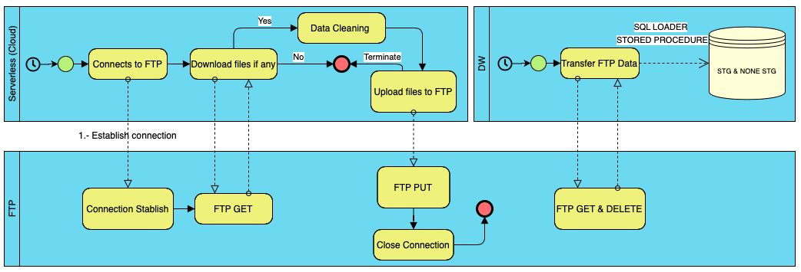
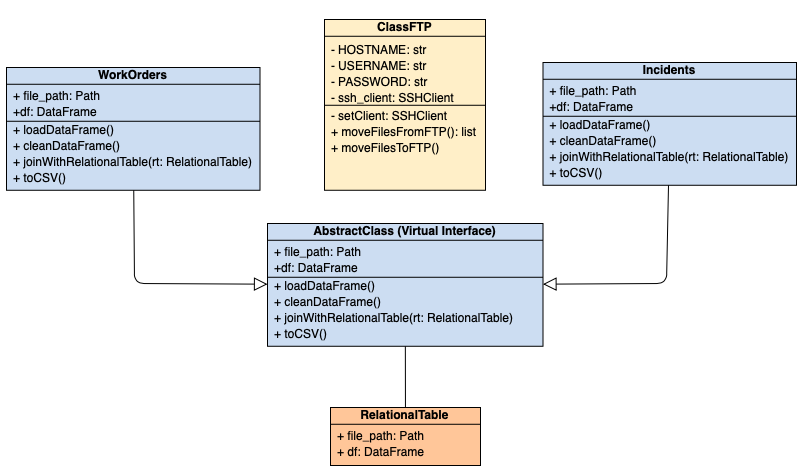

# DataEngineering-Saputo

This is the Saputo repository, the code in this module is being run in a container in Google Cloud Platform GCP, it establishes a connection to a FTP server seeking for new files, there are two different types of files that are process (Work Orders and Incidents) both are structure data (Excel files), if there are files to process, they are downloaded and posted to a Storage bucket, cleaned and transformed, after that the result is posted into the same FTP but in a different subdirectory. 

The code is being executed hourly and triggered by a GCP Cloud Scheduler Cron Job.

### BPMN Diagram


### Class Diagram


### Objective

> Develop a data pipeline for one of our customers
> Robust solution 100% Serverless.

### Tech

List of technologies used for this module

* Cloud Scheduler
* Cloud Function (Python 3.7)
* Cloud Storage
* Cloud Source Repositories (Mirror GitHub)

### Local Testing

Requires [Python](https://docs.conda.io/en/latest/miniconda.html) v3.7+ to run.

Install the dependencies

```sh
$ cd DataEngineering-Saputo
$ conda create -n venv python=3.7
$ conda activate venv
$ pip install -r requirements.txt
$ python main_test_locally.py
```
Note: To run locally deactivate python decorators and add your own credentials for the FTP


#### Building for source
if new lib added to the project update requirements.txt
```sh
$ pip freeze --local > requirements.txt
```

### Docker
GCP builds the container therefore the requirements.txt needs to be provided

```sh
FROM python:3.7-alpine
FROM python:3.7-slim-buster
WORKDIR /code
COPY requirements.txt requirements.txt
RUN pip install --no-cache-dir -r requirements.txt
COPY . .
CMD [ "python", "./main_test_locally.py" ]
```
 
## Authors
* **Luis Fuentes** - *2020-08-10*
* **Daniel Steinemann** - *2020-06-30*